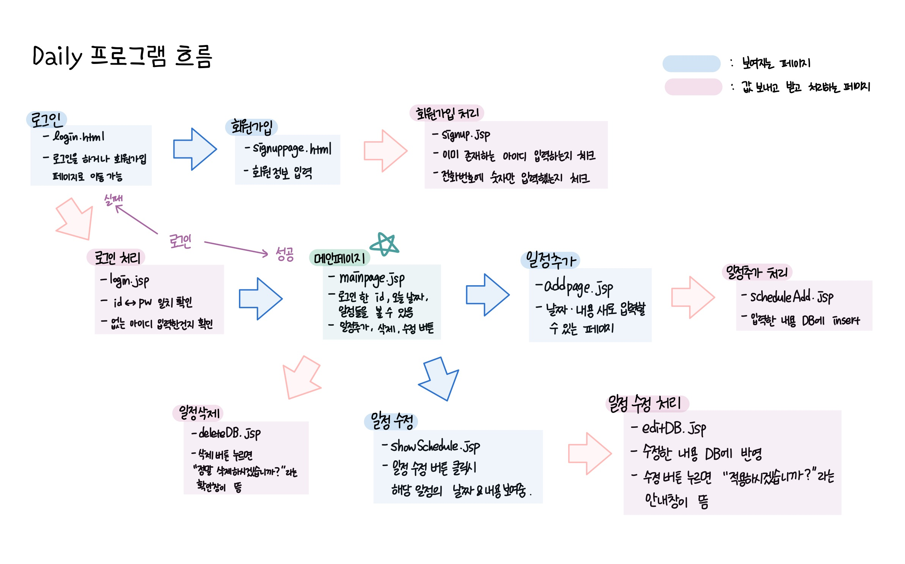
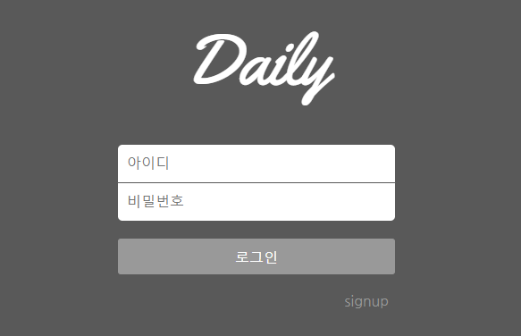
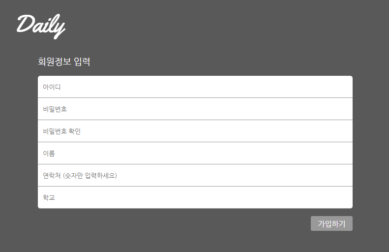
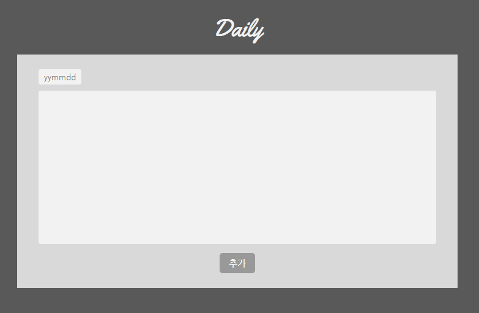

# 일정기록 프로그램 Daily

### 일정을 기록할 수 있는 프로그램 
 

**전체적인 흐름**

 
 

1. 로그인 페이지

 
 

2. 회원가입 페이지

  

 
 

3. 메인 페이지

 
 

4. 일정 추가 페이지

------------

## 부족한 점 
* 회원가입
1. 비밀번호에 영문자 + 숫자 + 특수문자 형태로 안 만듦 (현재 규칙 없음)
2. 전화번호에 아무 숫자나 입력해도 회원가입 가능함  
 

* 일정 추가 or 수정
1. 날짜에 숫자 1~5자리로 입력하면 에러남 
2. 날짜 yymmdd 형식으로 입력하지 않아도 저장됨 (예. 111111으로 해도 저장)