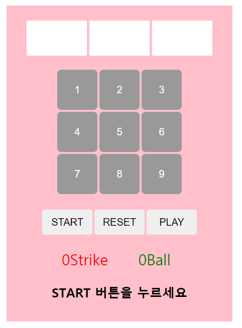

# Baseball Game

**<조건>**
1. 세 개의 숫자(1~9)를 난수 추첨한다. (중복 X)
2. 숫자 버튼을 클릭해서 숫자를 맞춘다.
3. 숫자 위치와 값이 같을 경우 strike, 값만 같고 위치가 다를 경우 ball
4. 숫자를 중복해서 클릭할 수 없다
5. 3strike일 경우 게임시작을 게임이 종료된다.

**<버튼 설명>**
- START : 1~9 사이의 숫자 세 개를 난수 추첨하며 "START버튼을 누르세요"문구가 "게임시작!"으로 변경됨  
- RESET : 클릭했던 숫자들과 strike, ball 상태가 리셋됨
- PLAY : 현재 입력해놓은 숫자를 맞춰야하는 숫자들과 비교하여 strike, ball 반환

