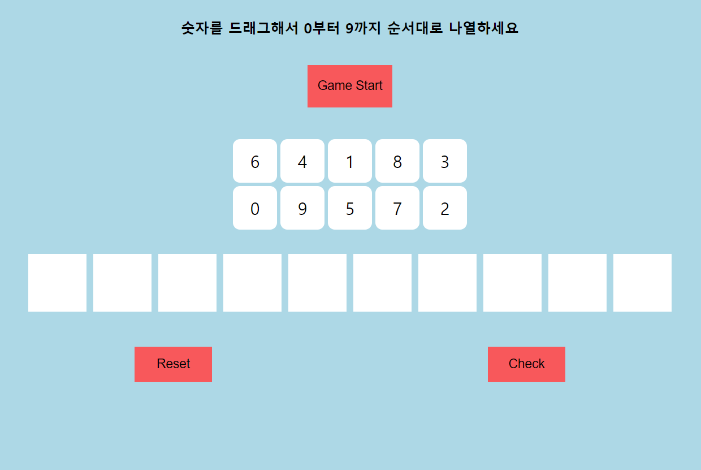

# 숫자배열하기 게임

## 각 버튼 의미
+ Game Start : 게임 시작하는 버튼. 누르면 0~9까지의 숫자가 랜덤으로 생성됨.
+ Reset : drag & drop 해놓은 숫자들을 reset할 수 있음. 랜덤으로 생성해 놓은 숫자와 진행 시간은 변하지 않음.
+ Check : 0부터 9까지 잘 배열했는지 확인할 수 있는 버튼. 잘 배열 되었으면 '정답입니다!'라는 문구와 함께 걸린 시간을 알려주지만 배열이 잘못 되었을 경우 아무런 값도 반환하지 않음.

------

## 게임방법
1. Game start 버튼을 누르면 0~9까지의 숫자가 랜덤으로 생성됨

2. 숫자를 직접 drag & drop해서 0부터 9까지 배열해야함. 

3. 0부터 9까지 배열한 후 check버튼을 누르면 '정답입니다!'라는 문구와 함께 걸린시간을 알려줌.

